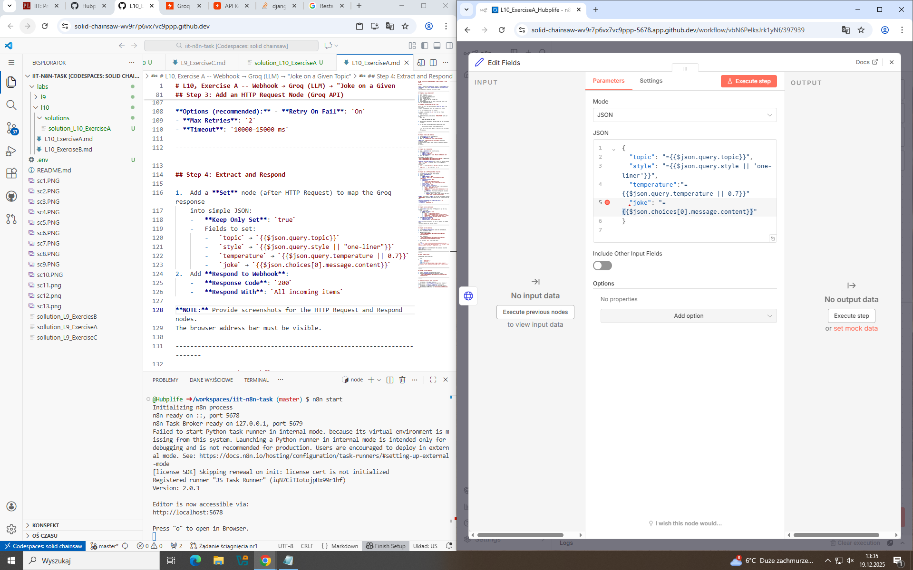
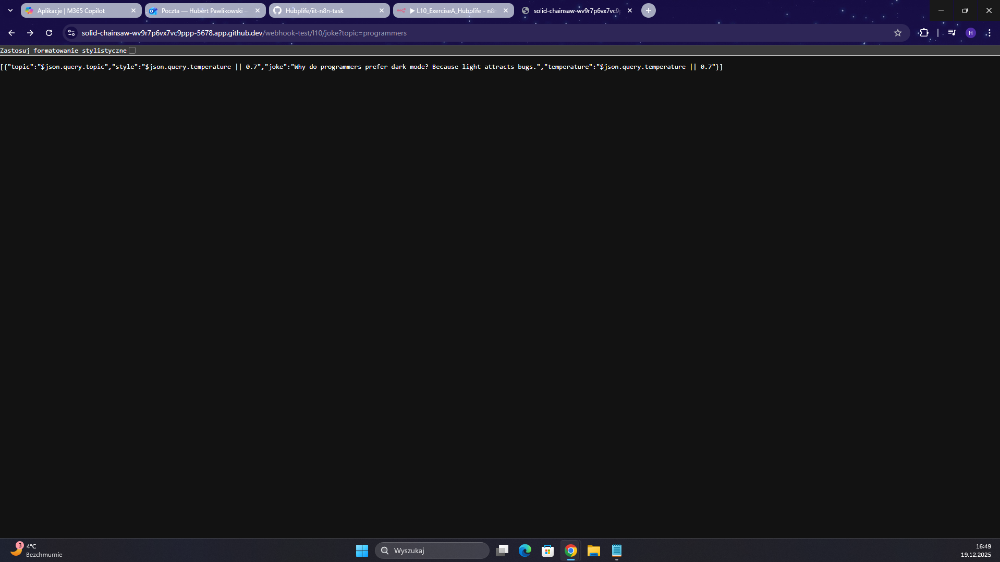
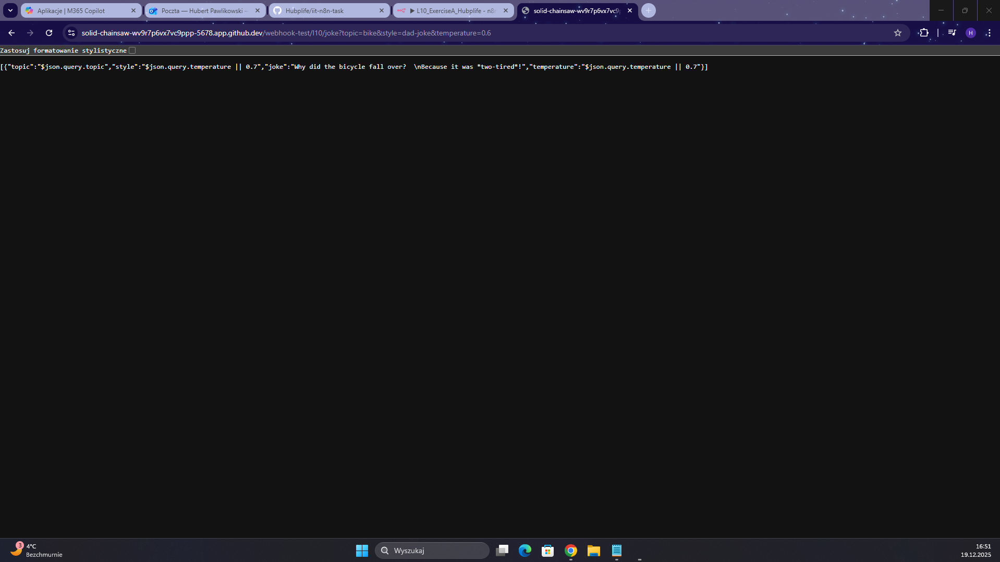

In this exercise I have set a webhook answer for request with API key and JSON. The request was a joke, every time diffrent.

The version of my n8n didn't allowed me to print the wanted values. I had a problem with JSON, so I decided to set variables diffrentlly. Some ot then can be seen by n8n and are printed in the result.

Creating a new workflow

Extreactig and responding

Testing the workflow

