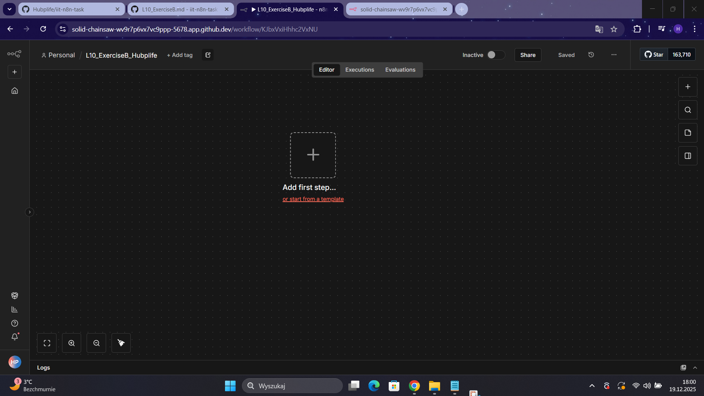
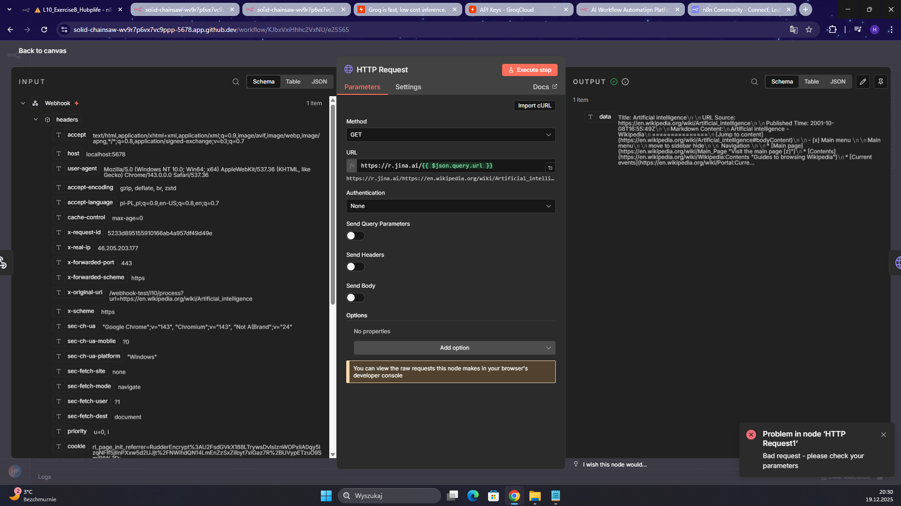
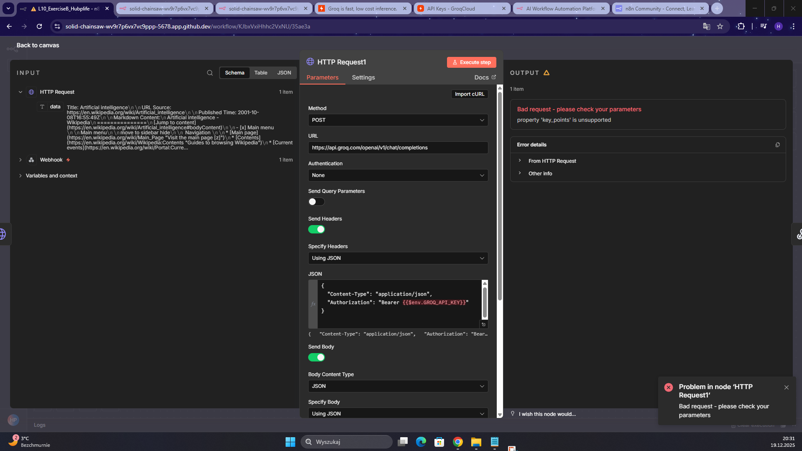
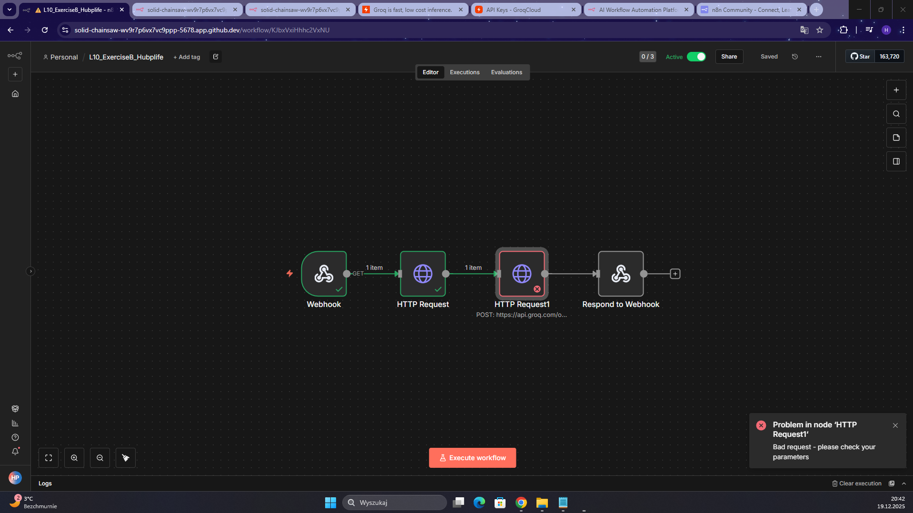

In This I tried to build a simple AI processing pipeline that combines external data retrieval with large language model reasoning. I did it with dividing them into groq and juni.ai configurations.
I did not managed to do this exercise properly, because in groq configuration the JSON code was not working and it was constantly printing the errors telling that some parameters are unsupported. The same errors happened when I tried to use this parameters with the option "fields below".

Creating a new workflow

Configuring Jina.ai HTTP Request

Configuring Groq http request configuration

Testing the workflow

